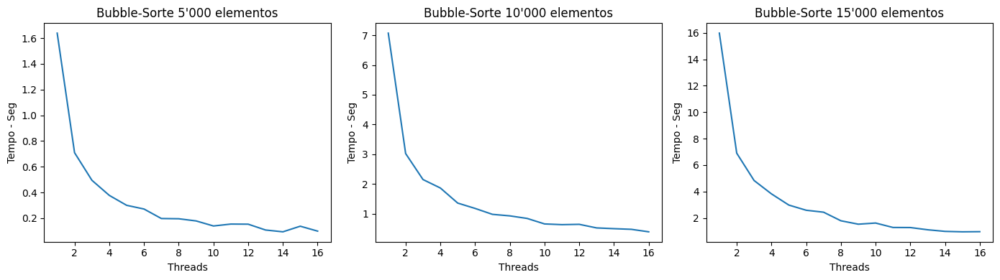
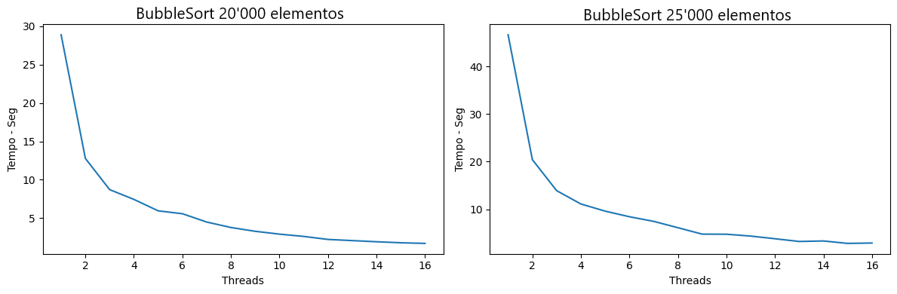
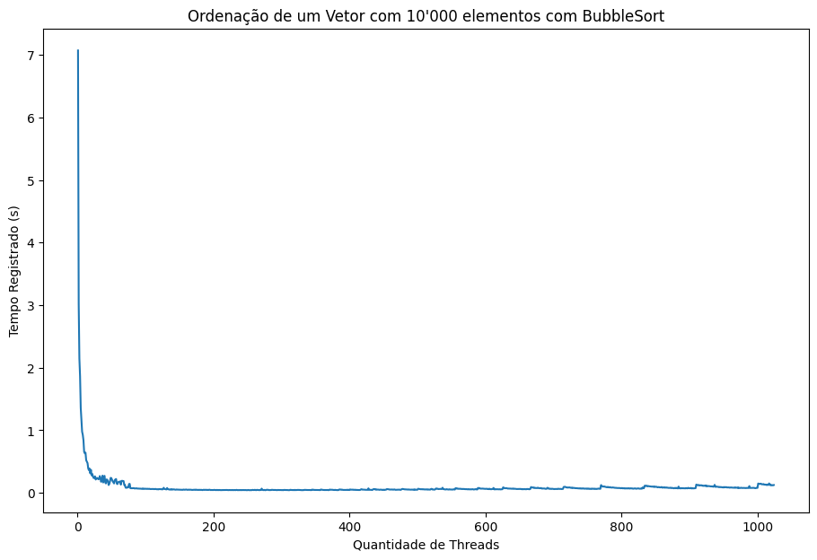
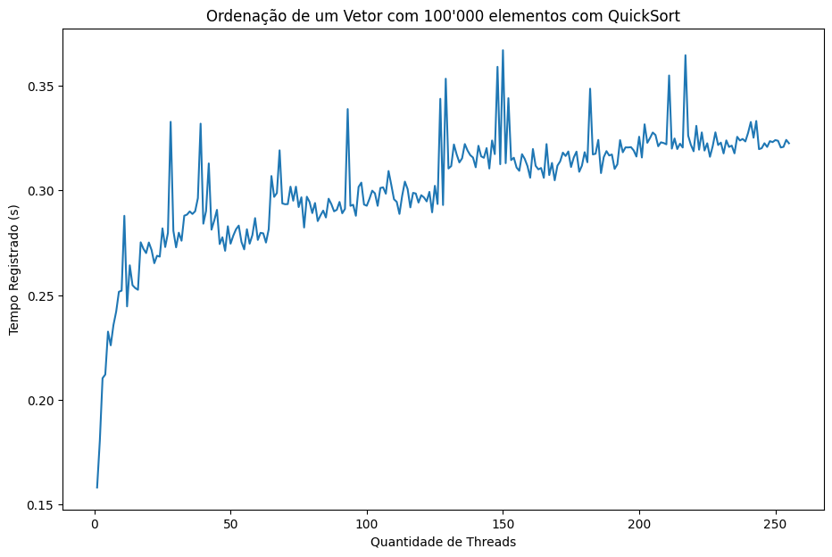

# Laboratório #1 -- Paralelismo de Processos e Threads

## Instruções para Compilação e Execução

> Para realizar a instalação basta clonar o repositório para um diretório local e realizar a instalação do python caso ele não esteja na sua máquina.

> Em sequência, realize a chamada do programa informando a quantidade de threads a serem executadas e o tamanho do vetor a ser ordenado. Caso esteja em um ambiente linux, a linha de comando ficará da seguinte forma:

```
$ python3 lab_01_threads.py {qtd_threads} {tam_vetor}  
```

## Implementação, Testes e Conclusões

### Construindo o Ambiente
A princípio destacamos que utilizamos *threads* como forma de paralelismo.

A partir daí, implementamos 2 algoritmos de *sort* distintos, *BubbleSort* e *QuickSort* para destacarmos o comportamento de cada um sob a implementação multi-thread.

### Testes com BubbleSort

Com o ambiente inicializado, decidimos iniciar uma bateria de testes com o algoritmo *BubbleSort* variando a quantidade de elementos e a quantidade de threads por teste. Nota-se que, devido a baixa eficiência desse algorítmo para a ordenação de grandes vetores, devido a sua complexidade **O(n²)**, os testes foram realizados com *arrays* de **5000** a **25000** elementos. 

Os resultados estão contidos no gráficos a seguir.


> Esse primeiro *plot* contém todos os testes realizados sob vetores de **5000** a **15000** elementos, com uma variação de **1** a **16** *threads* para cada. Nota-se um comportamnto similar em cada gráfico, um grande impacto do paralelismo sob o tempo necessário para a ordenação do vetor, com uma tendência de, a cada vez que a quantidade de *threads* dobra, o tempo é cortado pela metade.



> Seguimos para o próximo *plot*, agora com tamanhos de **20000**/ **25000** elementos e um comportamento similar foi registrado. O tempo gasto é muito otimizado com a utilização do paralelismo. Para exemplificar isso podemos destacar que o primeiro teste para o vetor de **25000** elementos marcou um tempo de **46.6** segundos para a conclusão da ordenação, agora para o mesmo *array* com 16 *threads*, apenas **2.9** segundos foram necessários, uma otimização de, aproximadamente, **16x**.
 





   