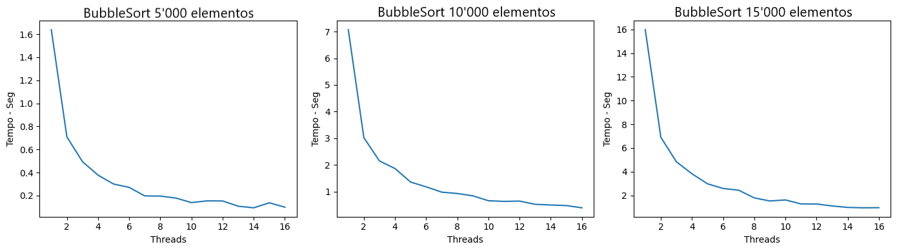

# Laboratório #1 -- Paralelismo de Processos e Threads
## Integrantes: Bruno Menegaz, Gustavo Dutra, Leonardo Albergaria
---
## Instruções para Compilação e Execução

> Para realizar a instalação basta clonar o repositório para um diretório local e realizar a instalação do python caso ele não esteja na sua máquina.

> Em sequência, realize a chamada do programa informando a quantidade de threads a serem executadas e o tamanho do vetor a ser ordenado. Caso esteja em um ambiente linux, a linha de comando ficará da seguinte forma:

```
$ python3 lab_01_threads.py {qtd_threads} {tam_vetor}  
```
---
## Link para o vídeo no Drive
https://drive.google.com/file/d/1E6dDy_tjK5xDBRRNZx16DMhmG3PYK99m/view?usp=sharing

---
## Implementação e Testes e Conclusões

### Construindo o Ambiente
Os testes foram realizados em um processador Intel 11ª geração Core i7-11390H @ 3.40GHz × 8.

Desca-se a utilização de *threads* como forma de paralelismo e a implementação de 2 algoritmos de *sort* distintos, *BubbleSort* e *QuickSort* 

### Testes com BubbleSort

Com o ambiente estabelecido, decidimos iniciar uma bateria de testes com o algoritmo *BubbleSort* variando a quantidade de elementos e a quantidade de threads por teste. Nota-se que, pela baixa eficiência desse algorítmo para a ordenação de grandes vetores, devido a sua complexidade **O(n²)**, os testes foram realizados com *arrays* de **5000** a **25000** elementos. 

Os resultados estão contidos no gráficos a seguir.

> Esse primeiro *plot* contém todos os testes realizados sob vetores de **5000** a **15000** elementos, com uma variação de **1** a **16** *threads* para cada. Nota-se um comportamento similar em cada gráfico, um grande impacto do paralelismo sob o tempo necessário para a ordenação do vetor, com uma tendência de, a cada vez que a quantidade de *threads* dobra, o tempo é cortado pela metade.


> Seguimos para o próximo *plot*, agora com tamanhos de **20000**/ **25000** elementos e um comportamento similar foi registrado. O tempo gasto é muito otimizado com a utilização do paralelismo. Para exemplificar isso podemos destacar que o primeiro teste para o vetor de **25000** elementos marcou um tempo de **46.6** segundos para a conclusão da ordenação, agora para o mesmo *array* com 16 *threads*, apenas **2.9** segundos foram necessários, uma otimização de, aproximadamente, **16x**.
 

> O *plot* abaixo apresenta os resultados dos testes realizados com um vetor de 10000 elementos usando um grande número de threads. Conforme o número de threads aumenta, o tempo de execução para de ser reduzido e acaba até aumentando um pouco. No entanto, essa variação é relativamente baixa em comparação com a redução observada inicialmente. Entre 1 e 8 threads, houve uma redução de 6 segundos no tempo de execução, já entre 100 e 1000 threads, houve um aumento pequeno de aproximadamente 0,2 segundos.


### Testes com QuickSort
> Por fim, o gráfico *plot* apresenta os resultados dos testes da implementação do algoritmo QuickSort em paralelo. Observamos que o comportamento dos testes não correspondeu às nossas expectativas iniciais, diferentemente do que foi observado em testes realizados na implementação com BubbleSort. Conforme o número de *threads* aumenta, o tempo de execução se mantém quase o mesmo (aumentando relativamente pouco), contrariando o que normalmente seria esperado, visto que, com mais *threads*, o trabalho é dividido em partes menores, o que deveria aumentar a eficiência do processo de ordenação. Vale ressaltar que utilizamos um vetor relativamente grande de 100000 elementos para que nossos testes não fossem afetados por conta de arrays pequenos. Após algumas discussões e testes, levantamos a hipótese de que o comportamento observado se deve à implementação do algoritmo que utiliza o princípio da recursão.

---
### Conclusão

Concluímos então que o uso de paralelismo com *threads* para ordenar um vetor teve resultados satisfatórios, onde a implementação com *BubbleSort* evidenciou maior eficiência ao utilizar mais *threads* para ordenar o vetor, com a redução de tempo ocorrendo da forma prevista. Já a implementação com *QuickSort* mostrou um resultado inesperado, não havendo aumento na eficiência mas sim uma leve piora, possivelmente por conta da implementação recursiva do algoritmo. De qualquer forma, foi possível observar as vantagens do paralelismo a partir da avaliação dos resultados e gráficos em geral.